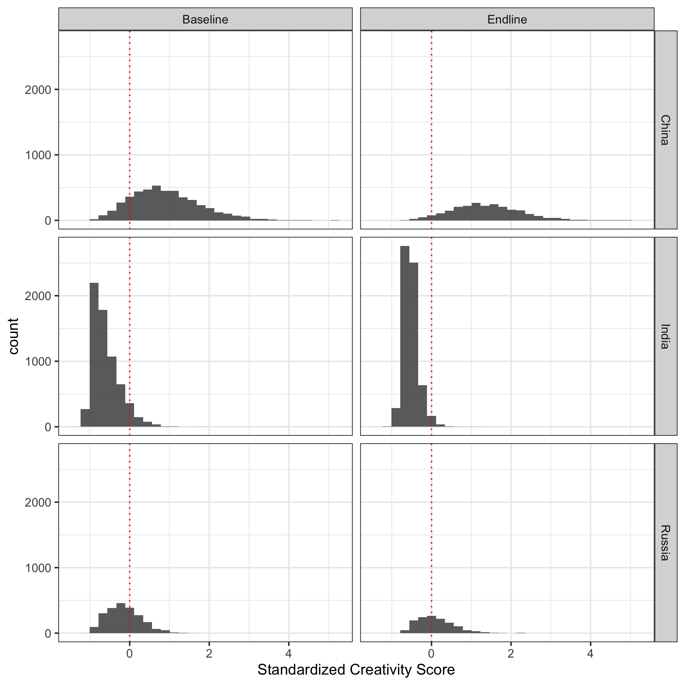

\captionsetup[table]{labelformat=empty}


```{r setup, include=FALSE}
knitr::opts_chunk$set(echo = FALSE, message = FALSE, warning = FALSE, fig.retina = 4)
```

```{r}
# Libraries
pacman::p_load(tidyverse, haven, texreg, estimatr, janitor, psych, nFactors, survey, srvyr, corrr, kable, kableExtra)

# Parameters
df_baseline <- read_dta(here::here("data/for_factor_analysis", "all_baseline_scored.dta")) %>% select(stdid, country, contains("response_category")) %>% remove_empty()
df_endline <- read_dta(here::here("data/for_factor_analysis", "all_endline_scored.dta")) %>% select(stdid, country, contains("response_category")) %>% remove_empty()

df_baseline %>% glimpse()
# df_endline %>% glimpse()
```

\newpage

# Creativity paper: Factor analysis approach

## Factor score distributions

```{r, eval=F}
## Factor Analysis: Baseline data

df_baseline_factor <-
  df_baseline %>% 
  pivot_longer(cols = contains("response_cat")) %>% 
  filter(value != "") %>% 
  distinct(country, stdid, value) %>% 
  mutate(score = 1L) %>% 
  pivot_wider(names_from = value, values_from = score, values_fill = 0L) %>%
  arrange(country, stdid)

df_baseline_factor %>% glimpse()

fit_b <- fa(r = cor(df_baseline_factor %>% select(-stdid, -country)), nfactors = 1, scores = "regression")
fit_b_scores <- factor.scores(df_baseline_factor %>% select(-stdid, -country), fit_b)
fit_b

temp_b <- df_baseline_factor %>% select(-stdid, -country) %>% as_data_frame()

cor(temp_b %>% rowSums())

for (i in 1:ncol(temp_b))
  print(cor(rowSums(temp_b), temp_b[, i]))

factanal(df_baseline_factor %>% select(-stdid, -country), factors = 1, scores = "regression")

df_baseline_factor %>% select(-stdid, -country) %>% write_csv("baseline_item_response_matrix.csv")
```

```{r, eval=F}
## Factor Analysis: Endline data

df_endline_factor <-
  df_endline %>% 
  pivot_longer(cols = contains("response_cat")) %>% 
  filter(value != "") %>% 
  distinct(country, stdid, value) %>% 
  mutate(score = 1L) %>% 
  pivot_wider(names_from = value, values_from = score, values_fill = 0L) %>%
  arrange(country, stdid)

fit_e <- fa(r = cor(df_endline_factor %>% select(-stdid, -country)), nfactors = 1, scores = "regression")
fit_e_scores <- factor.scores(df_endline_factor %>% select(-stdid, -country), fit_e)

fit_e

factanal(df_endline_factor %>% select(-stdid, -country), factors = 1, scores = "regression")
```


```{r, fig.retina=4, eval=F}
baseline_scores <-
  tibble(cr_fa_score = c(fit_b_scores$scores), endline = 0L) %>% 
  bind_cols(df_baseline_factor %>% select(stdid, country), .)

endline_scores <-
  tibble(cr_fa_score = c(fit_e_scores$scores), endline = 1L) %>% 
  bind_cols(df_endline_factor %>% select(stdid, country), .)

all_scores <- bind_rows(baseline_scores, endline_scores)

all_scores %>% 
  mutate(endline = if_else(endline == 1, "Endline", "Baseline")) %>%
  ggplot(aes(cr_fa_score)) +
  geom_histogram(alpha = 0.9) +
  geom_vline(xintercept = 0, linetype = "dotted", color = "red") +
  facet_grid(vars(country), vars(endline)) +
  theme_bw() +
  labs(x = "Standardized Creativity Score")

# ggsave("cr_fa_score.png")
# all_scores %>% write_dta(here::here("data/for_factor_analysis/cr_fa_scores.dta"))
```



\newpage

## Baseline factor loadings by country

```{r}
df_b_china <-
  df_baseline %>% 
  filter(country == "China") %>% 
  pivot_longer(cols = contains("response_cat")) %>% 
  filter(value != "") %>% 
  distinct(country, stdid, value) %>% 
  mutate(score = 1L) %>% 
  pivot_wider(names_from = value, values_from = score, values_fill = 0L) %>%
  arrange(country, stdid) %>% 
  select(-stdid, -country)


fit_b_china <- fa(r = cor(df_b_china), nfactors = 1, scores = "regression")

loadings_china <-
  tibble(
    response = c(df_b_china %>% colnames()),
    loadings_china = c(fit_b_china$loadings)
  )
```


```{r}
# India
df_b_india <-
  df_baseline %>% 
  filter(country == "India") %>% 
  pivot_longer(cols = contains("response_cat")) %>% 
  filter(value != "") %>% 
  distinct(country, stdid, value) %>% 
  mutate(score = 1L) %>% 
  pivot_wider(names_from = value, values_from = score, values_fill = 0L) %>%
  arrange(country, stdid) %>% 
  select(-stdid, -country)


fit_b_india <- fa(r = cor(df_b_india), nfactors = 1, scores = "regression")

loadings_india <-
  tibble(
    response = c(df_b_india %>% colnames()),
    loadings_india = c(fit_b_india$loadings)
  )
```


```{r}
# Russia
df_b_russia <-
  df_baseline %>% 
  filter(country == "Russia") %>% 
  pivot_longer(cols = contains("response_cat")) %>% 
  filter(value != "") %>% 
  distinct(country, stdid, value) %>% 
  mutate(score = 1L) %>% 
  pivot_wider(names_from = value, values_from = score, values_fill = 0L) %>%
  arrange(country, stdid) %>% 
  select(-stdid, -country)


fit_b_russia <- fa(r = cor(df_b_russia), nfactors = 1, scores = "regression")

loadings_russia <-
  tibble(
    response = c(df_b_russia %>% colnames()),
    loadings_russia = c(fit_b_russia$loadings)
  )
```


```{r}
# print table
loadings_china %>% 
  full_join(loadings_india, by = "response") %>% 
  full_join(loadings_russia, by = "response") %>% 
  arrange(-loadings_china) %>% 
  knitr::kable("latex", booktabs = TRUE, longtable = TRUE) %>%
  kable_styling(latex_options = c("hold_position", "repeat_header"))
```

\newpage

## Cross-country regressions using factor scores

```{r}
# Parameters
all_scores <- read_dta(here::here("data/for_factor_analysis/cr_fa_scores.dta"))

df <-
  read_dta(here::here("data", "x.dta")) %>%
  left_join(all_scores, by = c("stdid", "country", "endline")) %>%
  relocate(stdid, country, endline, cr_fa_score)

df_all <- df %>% as_survey_design(univcode, weights = sw_f)
```


```{r, eval=T}
# GAINS
lm1 <-
  df_all %>%
  filter(country == "Russia" & !is.na(cr_fa_score) & grade == 1 & endline == 0 & stu_merge != 2) %>% 
  svyglm(cr_fa_score ~ 1, design = .)

lm2 <-
  df_all %>%
  filter(country == "Russia" & !is.na(cr_fa_score) & grade == 3 & endline == 0 & stu_merge != 2) %>% 
  svyglm(cr_fa_score ~ 1, design = .)

lm3 <-
  df_all %>%
  filter(country == "Russia" & !is.na(cr_fa_score) & grade == 3 & endline == 1 & stu_merge != 1) %>% 
  svyglm(cr_fa_score ~ 1, design = .)

lm4 <-
  df_all %>% 
  filter(country == "Russia" & !is.na(cr_fa_score) & grade == 3 & stu_merge == 3) %>% 
  svyglm(cr_fa_score ~ endline, design = .)

texreg(list(lm1, lm2, lm3, lm4), include.ci = F)
```


```{r, eval=F}
# Cross country differences

lm5 <-
  df_all %>% filter(country != "China") %>% 
  filter(!is.na(cr_fa_score) & grade == 1 & endline == 0) %>% 
  svyglm(cr_fa_score ~ country, design = .)

lm6 <-
  df_all %>% filter(country != "China") %>% 
  filter(!is.na(cr_fa_score) & grade == 3 & endline == 0) %>% 
  svyglm(cr_fa_score ~ country, design = .)

lm7 <-
  df_all %>% filter(country != "China") %>% 
  filter(!is.na(cr_fa_score) & grade == 3 & endline == 1) %>% 
  svyglm(cr_fa_score ~ country, design = .)

# knitreg(list(lm5, lm6, lm7), include.ci = F)
```


### Factor analysis details - Creativity baseline test

```{r}
## Factor Analysis: Baseline data

df_baseline_factor <-
  df_baseline %>% 
  pivot_longer(cols = contains("response_cat")) %>% 
  filter(value != "") %>% 
  distinct(country, stdid, value) %>% 
  mutate(score = 1L) %>% 
  pivot_wider(names_from = value, values_from = score, values_fill = 0L) %>%
  arrange(country, stdid) %>% 
  select(-stdid, -country)

# fit_b <- fa(r = cor(df_baseline_factor %>% select(-stdid, -country)), nfactors = 1, scores = "regression")
# fit_b_scores <- factor.scores(df_baseline_factor %>% select(-stdid, -country), fit_b)
# fit_b
# factanal(df_baseline_factor %>% select(-stdid, -country), factors = 1, scores = "regression")

scree(df_baseline_factor, pc = FALSE)
```


